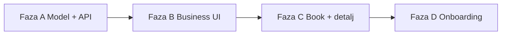

# MVP status, arhitektura i katalog igraonica (Faza A)

> Ažurirano: lipanj 2026.  
> Aktivni stack: **React + Vite + TypeScript** (client), **Express + Mongoose + MongoDB** (server).

---

## 1. Pregled dosadašnjeg rada

### Frontend

| Sloj | Status | Lokacija |
|------|--------|----------|
| Domenski tipovi | ✅ | `client/src/types/` |
| API ugovori | ✅ | `client/src/api/contracts/` |
| Mock + HTTP implementacije | ✅ | `client/src/mock/`, `client/src/api/implementations/http/` |
| Auth fasada | ✅ | `client/src/services/auth/` |
| Javne stranice | ✅ | Home, igraonice, detalj, Book wizard |
| Roditelj | ✅ | Profil, rezervacije, poruke |
| Igraonica | ✅ | Dashboard, kalendar, rezervacije, poruke, recenzije, postavke |
| Testovi | ✅ | Vitest (mock API + format) |
| E2E demo | ✅ | Playwright (`npm run e2e:demo`) |

### Backend

| Područje | Status |
|----------|--------|
| Auth (JWT, bcrypt, OIB za igraonicu) | ✅ |
| Venues (lista, detalj, busy slots) | ✅ |
| Rezervacije (create, list, konflikt termina) | ✅ |
| Poruke i recenzije | ✅ |
| Business KPI / overview | ✅ |
| Seed + test korisnici | ✅ |
| Integracijski testovi | ✅ |
| Plaćanje akontacije | ⏳ placeholder |
| Email (reset, potvrde) | ⏳ stub |

### Demo pristup

| Uloga | Email | Lozinka |
|-------|-------|---------|
| Roditelj | `ana.horvat@example.com` | `Test1234!` |
| Igraonica | `partner@igraonicasunce.hr` | `Test1234!` |

```bash
npm run dev                    # client :5173 + server :3000
cd server && npm run db:seed   # puni MongoDB demo podacima
```

Frontend uz bazu (`client/.env.development`):

```env
VITE_API_MODE=http
VITE_API_BASE_URL=/api
```

---

## 2. Usklađenost s arhitekturom

### Pravilo ovisnosti (frontend)

```
pages → api (contracts) → mock | http
mock ↛ pages   (zabranjeno)
```

### Backend slojevi

```
routes → controllers → services → models (Mongoose)
```

### Što je dobro

- UI ne uvozi mock direktno
- `createHttpApi.ts` i server rute dijele isti REST ugovor
- Rezervacije već imaju `addons[]` snapshot — pogodno za tortu, mađioničara itd.

### Poznata odstupanja

| Problem | Napomena |
|---------|----------|
| `docs/DATABASE.md`, `prisma/` | Zastarjelo — aktivno je **Mongoose** |
| `docs/MVP_ROADMAP.md` | Spominje Prisma, Axios, Zustand |
| Nove igraonice bez `Venue` u katalogu | Onboarding — Faza D |
| Slike na detalju | Picsum placeholder dok nema uploada |

---

## 3. Što MVP još treba (prioritet)

### Must-have prije produkcijskog launcha

1. **Katalog po venue** — paketi + dodaci u bazi (Faza A — ova dokumentacija)
2. **Business UI za uređivanje kataloga** (Faza B)
3. **Book wizard čita pakete/dodatke iz API-ja** (Faza C)
4. **Onboarding igraonice → prva lokacija** (Faza D)
5. **Stripe akontacija** (minimalno test → prod)
6. **Email potvrda rezervacije**
7. **Staging deploy + ručni smoke** (`docs/MVP_CHECKLIST.md`)

### Nice-to-have (ne blokira pilot)

- Admin moderacija
- Upload slika (Cloudinary/S3)
- Enforce limita po SaaS planu
- SMS notifikacije

---

## 4. Roadmap kataloga (4 faze)



| Faza | Opis | Status |
|------|------|--------|
| **A** | Model, seed, REST API, mock/http, testovi | ✅ implementirano |
| **B** | Stranica za uređivanje paketa i dodataka | ⏳ sljedeće |
| **C** | `/rezerviraj` i detalj igraonice iz kataloga | ⏳ |
| **D** | Registracija → automatski draft venue | ⏳ |

---

## 5. Faza A — domenski model

### Paket rođendana (`VenuePackage`)

| Polje | Tip | Opis |
|-------|-----|------|
| `id` | string | Stabilni ID (npr. `pkg-standard`) |
| `name` | string | npr. „Standard (2h)” |
| `description` | string | Kratki opis |
| `durationHours` | number | Trajanje u satima |
| `basePriceEur` | number | Osnovna cijena paketa |
| `maxGuests` | number? | Maks. broj djece |
| `includedItems` | string[] | Što je uključeno (animator, dekor…) |
| `active` | boolean | Vidljivo roditeljima |
| `sortOrder` | number | Redoslijed prikaza |

### Dodatna usluga (`VenueAddon`)

| Polje | Tip | Opis |
|-------|-----|------|
| `id` | string | npr. `addon-cake` |
| `name` | string | npr. „Torta po izboru” |
| `description` | string | |
| `category` | enum | `food` \| `entertainment` \| `decor` \| `other` |
| `priceEur` | number | |
| `active` | boolean | |
| `sortOrder` | number | |

### Kategorije dodataka (primjeri)

| Kategorija | Primjeri |
|------------|----------|
| `food` | Torta, catering, sladoled |
| `entertainment` | Mađioničar, animator, face painting |
| `decor` | Pinata, baloni, tematski dekor |
| `other` | Fotograf, VIP parking |

### Pravilo snapshot-a

Rezervacija (`Booking`) sprema **kopiju** odabranog paketa (`packageName`) i dodataka (`addons[]`) u trenutku bookinga — promjena cijene u katalogu ne mijenja postojeće rezervacije.

### MongoDB (`Venue` dokument)

Polja dodana na `Venue`:

- `description: string`
- `images: string[]`
- `packages: VenuePackage[]`
- `addons: VenueAddon[]`

`priceFrom` se automatski ažurira pri spremanju kataloga (minimum aktivnih paketa).

---

## 6. Faza A — REST API

### Javno (bez auth)

#### `GET /api/venues/:slug`

Detalj igraonice **s katalogom** (samo aktivni paketi i dodaci).

### Igraonica (auth: `business`)

#### `GET /api/businesses/me/venues`

Lista lokacija koje pripadaju prijavljenoj igraonici.

#### `GET /api/businesses/me/venues/:slug/catalog`

Puni katalog za uređivanje (uključuje neaktivne stavke).

#### `PUT /api/businesses/me/venues/:slug/catalog`

Ažurira opis, slike, pakete i dodatke. Validacija Zod shemom.

**Request body:**

```json
{
  "description": "string",
  "images": ["https://..."],
  "packages": [ { "id": "pkg-standard", "name": "...", ... } ],
  "addons": [ { "id": "addon-cake", "name": "...", "category": "food", ... } ]
}
```

**Response:** isti oblik kao `VenueCatalog`.

**Greške:**

| Status | Uzrok |
|--------|-------|
| 403 | Venue ne pripada ovoj igraonici |
| 404 | Venue ne postoji |
| 400 | Validacija (prazni paketi, negativne cijene…) |

### Frontend API (`businesses` + `venues`)

```typescript
// venuesApi
getBySlug(slug): Promise<Venue | null>  // uključuje katalog (aktivno)

// businessesApi
listMyVenues(): Promise<Venue[]>
getVenueCatalog(slug): Promise<VenueCatalog | null>
updateVenueCatalog(slug, input): Promise<VenueCatalog>
```

---

## 7. Seed podaci

Demo katalog za `igraonica-sunce` (business-001):

**Paketi:** Standard 180 €, Premium 280 €, VIP 360 €  
**Dodaci:** torta, mađioničar, pinata, fotograf, face painting, catering

Ostale seed lokacije imaju barem jedan paket i nekoliko dodataka.

Nakon promjene sheme:

```bash
cd server
npm run db:seed
```

---

## 8. Testovi (Faza A)

```bash
npm run test   # server + client
```

Server integracija pokriva:

- `GET /venues/:slug` vraća pakete i dodatke
- `GET /businesses/me/venues` za igraonicu
- `GET /businesses/me/venues/:slug/catalog`
- `PUT` ažurira katalog i `priceFrom`
- `403` za tuđi venue

---

## 9. Sljedeći korak — Faza B (business UI)

1. Nova ruta npr. `/postavke-igraonice/katalog` ili `/moja-lokacija`
2. Odabir lokacije (ako ih ima više)
3. CRUD forma za pakete i dodatke
4. Preview kako roditelj vidi ponudu

Vidi checklist u `docs/ARCHITECTURE.md` — nova domena: types → contracts → mock → http → stranica.

---

## 10. Korisne naredbe

```bash
npm run dev
npm run test
cd server && npm run db:seed
cd server && npm run db:seed:test-users
npm run e2e:demo
```
